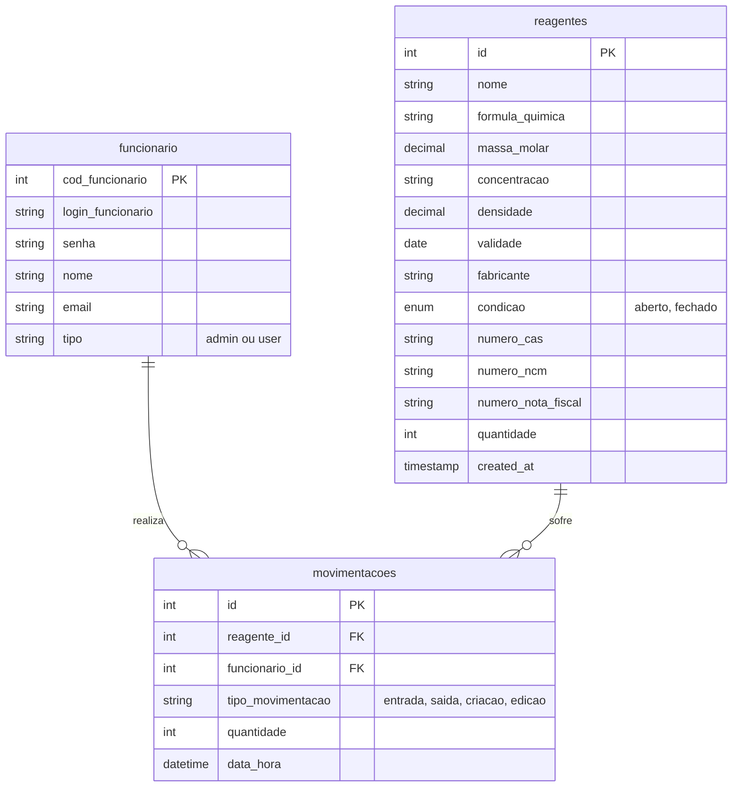

# Documentação do Banco de Dados - Chemicall

Esta documentação descreve a estrutura atual do banco de dados utilizado na aplicação Chemicall.

## Diagrama ER (Entidade-Relacionamento)

## Descrição das Tabelas

### 1. funcionario
Armazena os dados dos usuários do sistema (administradores e docentes/técnicos).
- **cod_funcionario**: Identificador único.
- **tipo**: Define o nível de acesso ('admin' tem acesso total).

### 2. reagentes
Armazena o inventário de reagentes químicos.
- **id**: Identificador único.
- **quantidade**: Quantidade atual em estoque (em unidades, ex: frascos).
- **validade**: Data de validade do reagente.

### 3. movimentacoes
Registra o histórico de todas as operações realizadas no estoque.
- **tipo_movimentacao**:
    - `criacao`: Quando um novo reagente é cadastrado.
    - `edicao`: Quando os dados de um reagente são alterados.
    - `entrada`: Adição de quantidade ao estoque.
    - `saida`: Remoção de quantidade do estoque.
- **data_hora**: Momento exato da operação.
