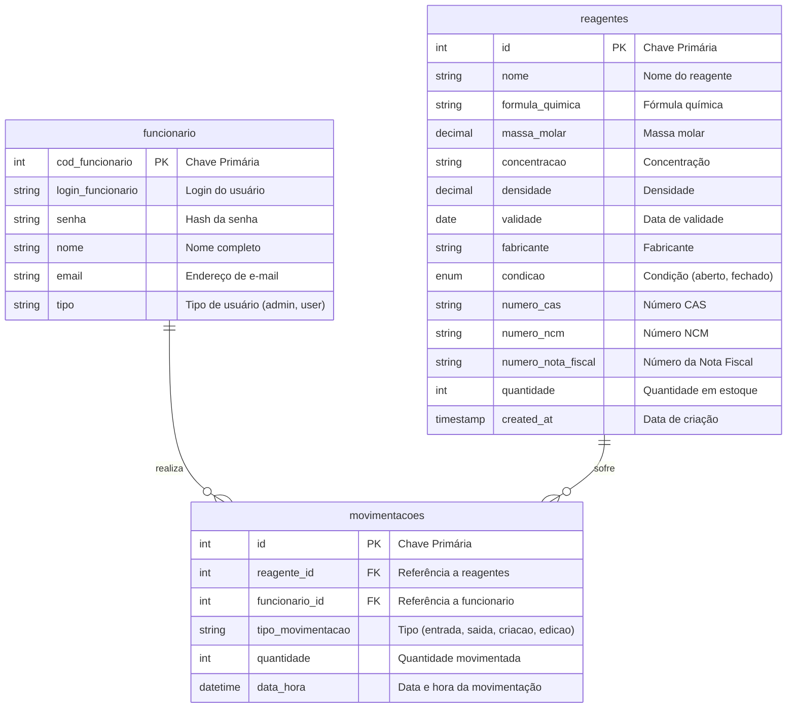

# Diagrama ER do Banco de Dados - Chemicall

Este documento apresenta o diagrama Entidade-Relacionamento (ER) do banco de dados da aplicação Chemicall, baseado na análise dos arquivos de criação de tabelas (`create_tables.php`, `create_logs_table.php` e `chemicall_schema.sql`).

## Diagrama Mermaid

## Dicionário de Dados

### Tabela: `funcionario`
Responsável por armazenar os dados de autenticação e identificação dos usuários do sistema.
- **cod_funcionario**: Identificador único do funcionário.
- **login_funcionario**: Nome de usuário para acesso.
- **senha**: Senha criptografada.
- **nome**: Nome real do funcionário.
- **email**: E-mail de contato.
- **tipo**: Nível de permissão (ex: 'admin' para administradores).

### Tabela: `reagentes`
Armazena as informações detalhadas sobre os reagentes químicos disponíveis no estoque.
- **id**: Identificador único do reagente.
- **nome**: Nome comercial ou IUPAC do reagente.
- **validade**: Data limite para uso seguro.
- **quantidade**: Quantidade atual disponível.
- **condicao**: Estado do recipiente (Aberto/Fechado).

### Tabela: `movimentacoes`
Registra o histórico de operações realizadas, garantindo rastreabilidade.
- **id**: Identificador único da movimentação.
- **reagente_id**: Chave estrangeira ligando ao reagente movimentado.
- **funcionario_id**: Chave estrangeira ligando ao funcionário que realizou a ação.
- **tipo_movimentacao**: Natureza da operação (Entrada, Saída, etc.).
- **quantidade**: Quantidade afetada na operação.
- **data_hora**: Carimbo de tempo da operação.
